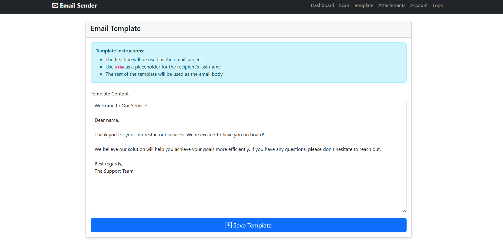
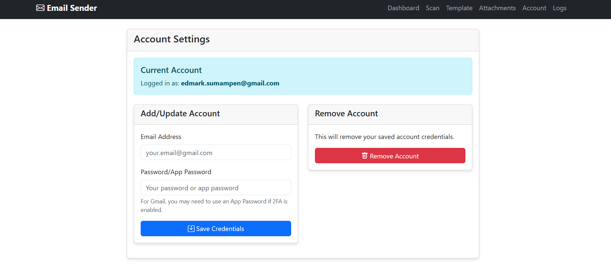

# EmailSender
A web-based email automation tool that sends personalized emails using data from Google Sheets. This application replaces the console-based version with a modern web interface.

 
 
 
 
 
 

📋 Prerequisites
System Requirements
Python 3.7 or higher

500MB free disk space

Internet connection

Required Accounts
Google Account (for Google Sheets API)

Gmail Account (for sending emails)

🚀 Installation
Step 1: Download the Application
bash
# Clone or download the application files
# Save the Python script as 'email_sender_web.py'
Step 2: Install Python Dependencies
bash
# Install required packages
pip install flask gspread oauth2client python-dotemail

# Or create a requirements.txt file and install all at once:
pip install -r requirements.txt
requirements.txt:

txt
Flask==2.3.3
gspread==5.11.3
oauth2client==4.1.3
python-dotenv==1.0.0
Step 3: Create Necessary Directories
The application will automatically create these directories, but you can create them manually:

bash
mkdir -p EmailTemplate Files templates
Step 4: Run the Application
bash
python email_sender_web.py
You should see:

text
Starting Email Sender Web Application...
Access the application at: http://localhost:5000
Step 5: Access the Web Interface
Open your web browser and navigate to:

text
http://localhost:5000
🔧 Google Sheets API Setup
Step 1: Create a Google Cloud Project
Go to Google Cloud Console

Click "Create Project" or select existing project

Name your project (e.g., "Email Sender App")

Click "Create"

Step 2: Enable Google Sheets API
In your project dashboard, go to "APIs & Services" → "Library"

Search for "Google Sheets API"

Click on "Google Sheets API"

Click "Enable"

Step 3: Create Service Account Credentials
Go to "APIs & Services" → "Credentials"

Click "Create Credentials" → "Service Account"

Fill in the details:

Service account name: email-sender-service

Service account ID: (auto-generated)

Description: "Service account for email sender application"

Click "Create and Continue"

For "Role", select:

Basic → Viewer (or create custom role with sheets read-only access)

Click "Continue" then "Done"

Step 4: Generate Service Account Key
In the credentials list, find your service account

Click on the service account email

Go to "Keys" tab

Click "Add Key" → "Create New Key"

Select "JSON" format

Click "Create"

Important: The JSON key file will download automatically - save it securely!

Step 5: Share Your Google Sheet
Open your Google Sheet

Click "Share" button

Add your service account email (found in the JSON file as "client_email")

Set permission to "Viewer" or "Editor" (depending on your needs)

Click "Share"

⚙️ Configuration
Step 1: Set Up Email Account
Access the web application at http://localhost:5000

Click "Account Settings" in navigation

Click "Add/Update Account"

Enter your Gmail credentials:

Email Address: your.email@gmail.com

Password: Your Gmail password or App Password

🔐 Gmail App Password (Recommended for 2FA)
If you have 2-Factor Authentication enabled:

Go to Google Account Security

Under "Signing in to Google", select "2-Step Verification"

Scroll down to "App passwords"

Select "Mail" and "Other" (Custom name: "Email Sender")

Generate and copy the 16-character app password

Use this app password in the application instead of your regular password

Step 2: Configure Email Template
Click "Edit Template" in navigation

Modify the template following these rules:

First line: Email subject

Second line onwards: Email body

Use name as placeholder for recipient's name

Click "Save Template"

Example Template:

text
Welcome to Our Service!

Dear name,

Thank you for registering with our service. We're excited to have you on board!

Best regards,
The Team
Step 3: Prepare Your Google Sheet
Your Google Sheet should have this structure:

| A | B | C | D | E |
|---|---||---|---|
| Header1 | Name | Header3 | Header4 | Email |
| Data1 | John | Data3 | Data4 | john@email.com |
| Data2 | Jane | Data3 | Data4 | jane@email.com |

Note: The application skips the first row (headers)

📤 Usage
Step 1: Scan Data from Google Sheets
Click "Scan Data" in navigation

Fill in the form:

Service Account Key File Location: Full path to your JSON key file

Example: /home/user/credentials/service-account.json

Example: C:\Users\user\Downloads\service-account.json

Google Sheet ID: Found in your sheet URL

URL format: https://docs.google.com/spreadsheets/d/SHEET_ID/edit

Email Column Number: Column containing emails (A=1, B=2, etc.)

Name Column Number: Column containing names

Name Type: Type of name in that column

Click "Preview Columns" to verify

Click "Start Scan"

Step 2: Add Attachments (Optional)
Click "Manage Attachments"

Click "Choose File" and select files

Click "Upload File"

Repeat for multiple attachments

Step 3: Send Emails
Go to Dashboard

Click "Start Sending Emails"

Monitor progress in the popup window

View logs in "View Logs" section

🛠️ Troubleshooting
Common Issues & Solutions
1. "Permission denied" Error
Problem: Cannot read service account key file
Solution:

bash
# Linux/Mac: Fix permissions
chmod 644 /path/to/your/service-account.json

# Windows: Right-click file → Properties → Security → Add your user with Read permissions
2. Gmail Authentication Error
Problem: Cannot login to Gmail
Solution:

Use App Password instead of regular password

Enable "Less secure app access" (not recommended)

Check if 2-Factor Authentication is enabled

3. Google Sheets Access Error
Problem: Cannot access Google Sheet
Solution:

Verify service account email is shared on the sheet

Check Sheet ID is correct

Ensure Sheets API is enabled

4. "No data found" Error
Problem: Scan finds no data
Solution:

Check column numbers are correct

Verify sheet has data beyond header row

Use "Preview Columns" to test

5. Port Already in Use
Problem: Cannot start application on port 5000
Solution:

bash
# Use different port
python email_sender_web.py --port 5001

# Or find and kill process using port
lsof -ti:5000 | xargs kill -9
File Structure
text
email_sender_web.py
EmailTemplate/
└── template1.txt
Files/
└── (attachments go here)
templates/
├── base.html
├── index.html
├── scan.html
├── account.html
├── template.html
├── attachments.html
└── logs.html
credentials.txt
extracted_data.json
logs.txt
Security Notes
Never commit your service account JSON file to version control

Use app passwords instead of your main Gmail password

Restrict permissions on your service account

Regularly rotate credentials and app passwords

📞 Support
If you encounter issues:

Check the troubleshooting section above

Verify all prerequisites are met

Ensure correct file permissions

Check application logs for detailed error messages

🎯 Features Summary
✅ Web-based interface

✅ Custom column mapping for Google Sheets

✅ Personalized email templates

✅ File attachments support

✅ Real-time progress tracking

✅ Email sending logs

✅ Multiple name type support (First/Last/Full Name)

✅ Column preview before scanning
